# Architecture Diagrams

This document contains visual architecture diagrams for the LlamaIndex Local RAG pipeline using Mermaid.

---

## 1. Overall RAG Pipeline (High-Level)

```mermaid
flowchart TB
    subgraph Input
        A[📄 Documents<br/>PDF/DOCX/HTML/MD]
    end

    subgraph Indexing["🔧 Indexing Phase (One-Time)"]
        B[🔪 Chunking<br/>SentenceSplitter<br/>900 chars, 120 overlap]
        C[🧬 Embedding<br/>bge-small-en<br/>384-dim vectors]
        D[💾 Storage<br/>PostgreSQL + pgvector<br/>IVFFLAT index]
    end

    subgraph Query["❓ Query Phase (Real-Time)"]
        E[User Query]
        F[🧬 Query Embedding<br/>Same model]
        G[🔍 Vector Search<br/>Cosine similarity<br/>Top-K=4]
        H[📊 Reranking<br/>Cross-encoder<br/>Optional]
        I[🤖 LLM Generation<br/>Mistral 7B<br/>llama.cpp/vLLM]
    end

    subgraph Output
        J[✅ Answer +<br/>Source Citations]
    end

    A --> B
    B --> C
    C --> D

    E --> F
    F --> G
    D -.Vector DB.-> G
    G --> H
    H --> I
    I --> J

    style A fill:#e1f5ff
    style J fill:#c8e6c9
    style D fill:#fff9c4
    style I fill:#ffe0b2
```



---

## 2. Indexing Phase (Detailed)

```mermaid
flowchart LR
    subgraph Load["📄 Document Loading"]
        A1[PDF Files] --> A2[PyMuPDFReader]
        A2 --> A3[Document Objects<br/>1 per page]
    end

    subgraph Chunk["🔪 Text Chunking"]
        A3 --> B1[SentenceSplitter<br/>chunk_size=900<br/>overlap=120]
        B1 --> B2[Text Chunks<br/>~6.6 per page]
    end

    subgraph Embed["🧬 Embedding"]
        B2 --> C1[Batch Processing<br/>EMBED_BATCH=128]
        C1 --> C2[HuggingFace Model<br/>bge-small-en]
        C2 --> C3[Metal/CUDA<br/>Acceleration]
        C3 --> C4[384-dim Vectors<br/>150-200 chunks/s]
    end

    subgraph Store["💾 Database Storage"]
        C4 --> D1[TextNode Creation<br/>text + embedding + metadata]
        D1 --> D2[Batch Insert<br/>DB_INSERT_BATCH=500]
        D2 --> D3[PostgreSQL + pgvector<br/>1250 nodes/s]
        D3 --> D4[IVFFLAT Index<br/>Fast similarity search]
    end

    style A1 fill:#e1f5ff
    style C3 fill:#ffecb3
    style D4 fill:#fff9c4
```



---

## 3. Query Phase (Detailed)

```mermaid
flowchart TB
    subgraph Input["❓ User Input"]
        Q1[User Question<br/>"What are the key findings?"]
    end

    subgraph Cache["💾 Query Cache (Optional)"]
        Q2{Semantic<br/>Cache Hit?}
        Q3[Return Cached<br/>Answer<br/>~50ms]
    end

    subgraph Expand["🔀 Query Expansion (Optional)"]
        Q4[Generate Related<br/>Queries]
        Q5[Merge Results]
    end

    subgraph Embed["🧬 Query Embedding"]
        E1[bge-small-en Model]
        E2[384-dim Vector<br/>~12ms]
    end

    subgraph Retrieve["🔍 Vector Similarity Search"]
        R1[PostgreSQL Query<br/>embedding <=> vector]
        R2[Cosine Distance]
        R3[Top-K Results<br/>~11ms]
    end

    subgraph Rerank["📊 Reranking (Optional)"]
        RR1[Cross-Encoder Model<br/>ms-marco-MiniLM]
        RR2[Reorder by<br/>Relevance Score]
        RR3[+15-30% Quality]
    end

    subgraph Generate["🤖 LLM Generation"]
        G1[Build Context<br/>from Retrieved Chunks]
        G2[Construct Prompt<br/>Context + Question]
        G3[LlamaCPP / vLLM<br/>Mistral 7B]
        G4[Generated Answer<br/>8-15s CPU<br/>2-3s vLLM]
    end

    subgraph Output["✅ Output"]
        O1[Answer + Citations<br/>with Source Pages]
    end

    Q1 --> Q2
    Q2 -->|Yes| Q3
    Q2 -->|No| Q4
    Q3 --> O1
    Q4 --> Q5
    Q5 --> E1
    E1 --> E2
    E2 --> R1
    R1 --> R2
    R2 --> R3
    R3 --> RR1
    RR1 --> RR2
    RR2 --> RR3
    RR3 --> G1
    G1 --> G2
    G2 --> G3
    G3 --> G4
    G4 --> O1

    style Q1 fill:#e1f5ff
    style Q3 fill:#c8e6c9
    style RR3 fill:#fff9c4
    style G4 fill:#ffe0b2
    style O1 fill:#c8e6c9
```

---

## 4. System Architecture (Infrastructure)


---

## 5. Performance Optimization Flow

```mermaid
flowchart LR
    subgraph Hardware["🖥️ Hardware Detection"]
        H1{Platform?}
        H2[Apple Silicon<br/>M1/M2/M3]
        H3[NVIDIA GPU<br/>CUDA]
        H4[CPU Only]
    end

    subgraph Optimization["⚡ Optimizations"]
        O1[Metal Acceleration<br/>MPS Backend<br/>5-20x faster]
        O2[CUDA Acceleration<br/>vLLM Server<br/>3-4x faster]
        O3[CPU Mode<br/>Standard]
    end

    subgraph Batching["📦 Batch Processing"]
        B1[Embedding Batch<br/>EMBED_BATCH=128]
        B2[DB Insert Batch<br/>DB_INSERT_BATCH=500]
        B3[1.5-2x Speedup]
    end

    subgraph Caching["💾 Caching Layers"]
        C1[Semantic Query Cache<br/>10-100x speedup]
        C2[Query Result Cache<br/>SQLite]
        C3[Model Weight Cache<br/>~/.cache/huggingface]
    end

    subgraph Memory["🧠 Memory Management"]
        M1[Garbage Collection<br/>After Embed/Query]
        M2[GPU Layer Tuning<br/>N_GPU_LAYERS=24]
        M3[<14GB Total<br/>16GB RAM]
    end

    H1 -->|Mac| H2
    H1 -->|Linux/Win + GPU| H3
    H1 -->|Other| H4

    H2 --> O1
    H3 --> O2
    H4 --> O3

    O1 --> B1
    O2 --> B1
    O3 --> B1

    B1 --> B2
    B2 --> B3
    B3 --> C1
    C1 --> C2
    C2 --> C3
    C3 --> M1
    M1 --> M2
    M2 --> M3

    style H2 fill:#ffecb3
    style O1 fill:#fff9c4
    style O2 fill:#fff9c4
    style B3 fill:#c8e6c9
    style C1 fill:#e1f5ff
    style M3 fill:#c8e6c9
```



---

## 6. Data Flow with Performance Metrics


---

## 7. Security & Monitoring Architecture

```mermaid
flowchart TB
    subgraph Application["🔧 RAG Application"]
        APP[Main Pipeline<br/>rag_low_level_m1_16gb_verbose.py]
        HEALTH[Health Check<br/>utils/health_check.py]
        METRICS[Metrics Export<br/>utils/metrics.py]
    end

    subgraph Database["💾 PostgreSQL"]
        DB[Vector Store<br/>pgvector]
        DBEXP[PostgreSQL Exporter<br/>DB Metrics]
    end

    subgraph Monitoring["📊 Monitoring Stack"]
        PROM[Prometheus<br/>Time-Series DB<br/>30-day retention]
        GRAF[Grafana<br/>Dashboards<br/>Auto-provisioned]
        ALERT[Alertmanager<br/>Critical Alerts<br/><2min detection]
    end

    subgraph Operations["🛠️ Operations"]
        BACKUP[Backup Service<br/>Daily 2AM<br/>7-day retention]
        VERIFY[Backup Verification<br/>Automated]
        CRON[Cron Jobs<br/>Scheduling]
    end

    subgraph Security["🔒 Security"]
        SCAN[Security Scanner<br/>scripts/security_scan.sh<br/>Bandit + checks]
        ENV[Environment Variables<br/>No hardcoded credentials]
        SQL[Parameterized Queries<br/>SQL injection protection]
    end

    subgraph CI_CD["🔄 CI/CD Pipeline"]
        TEST[310+ Tests<br/>30.94% coverage]
        REGRESS[Performance Regression<br/>Automated baselines]
        QUALITY[Code Quality<br/>Black, Ruff, MyPy]
    end

    APP --> HEALTH
    APP --> METRICS
    APP --> DB

    METRICS -.Prometheus format.-> PROM
    DBEXP -.DB metrics.-> PROM
    DB --> DBEXP

    PROM --> GRAF
    PROM --> ALERT

    DB -.Backup.-> BACKUP
    BACKUP --> VERIFY
    VERIFY --> CRON

    APP -.Scanned by.-> SCAN
    APP --> ENV
    APP --> SQL

    APP -.Tested by.-> TEST
    TEST --> REGRESS
    TEST --> QUALITY

    style APP fill:#e1f5ff
    style PROM fill:#fff9c4
    style GRAF fill:#c8e6c9
    style BACKUP fill:#ffe0b2
    style SCAN fill:#f8bbd0
    style TEST fill:#c8e6c9
```



---

## 8. Performance Tracking & Regression Detection


**Key Features:**

1. **Automated Testing**: Performance tests run on every PR and nightly
2. **Multi-Platform**: Tracks baselines for M1 Mac, GPU servers, GitHub Actions
3. **Regression Detection**: Automatically blocks PRs with >20% performance degradation
4. **Trend Visualization**: Interactive Plotly dashboard with 8 performance metrics
5. **Smart Baselines**: Auto-updates on sustained improvements (5+ runs, >5% better)
6. **Git Integration**: Tracks commit hash, branch, and date for every run
7. **Multiple Outputs**: Dashboard (HTML), Reports (Markdown/HTML/JSON)

**Tracked Metrics:**
- Query Latency (end-to-end)
- Embedding Throughput (chunks/second)
- Vector Search Latency (milliseconds)
- Database Insertion Rate (nodes/second)
- Memory Usage (peak GB)
- Cache Hit Rate (percentage)
- Mean Reciprocal Rank (retrieval quality)
- LLM Tokens/second (generation speed)

---

## Diagram Usage

### Viewing Diagrams

**In GitHub/GitLab:**
- Mermaid diagrams render automatically in markdown files
- View this file directly in the repository browser

**In VS Code:**
- Install "Markdown Preview Mermaid Support" extension
- Open markdown preview (Cmd/Ctrl + Shift + V)

**In Other Editors:**
- Copy diagram code to [Mermaid Live Editor](https://mermaid.live/)
- Export as PNG/SVG for documentation

### Customizing Diagrams

To modify these diagrams:
1. Edit the mermaid code blocks in this file
2. Test in [Mermaid Live Editor](https://mermaid.live/)
3. Update documentation as needed

### References

- [Mermaid Documentation](https://mermaid.js.org/)
- [Flowchart Syntax](https://mermaid.js.org/syntax/flowchart.html)
- [Graph Syntax](https://mermaid.js.org/syntax/graph.html)
